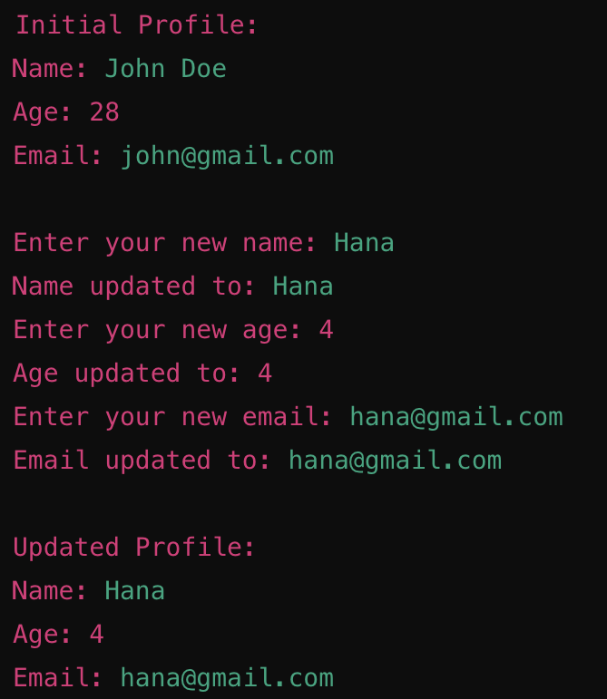

# Data type & function challeneges

## Challenge 1: String and Number Processor

- Objective: Create a function that processes a mix of string and number inputs.
- Description: Concatenate string inputs into a single sentence and sum up all number inputs. The function should print the final concatenated string and the sum of numbers.
- Test Case: StringNumberProcessor("Hello", 100, 200, "World")
- Expected Outcome: "Hello World; 300"

## Challenge 2: Guessing Game

- Objective: Implement a number guessing game.
- Description: The function generates a random number and prompts the user to guess it. It provides feedback and continues until the correct guess is made.
- Execution: Uncomment GuessingGame() in Main to test.
- Expected Outcome: The game continues with user input until the correct number is guessed.

## Challenge 3: Simple Word Reversal

- Objective: Reverse each word in a given sentence.
- Description: The function takes a string and reverses each word in it. Words are separated by spaces, and punctuation remains attached to the word.
- Test Case: ReverseWords("This is the original sentence!")
- Expected Outcome: "sihT si eht lanigiro !ecnetnes"

## Challenge 4: User Profile Updater

- Objective: Write a function to update user profile details using the `ref` parameter modifier.

- Description: The function should allow updating a user's profile details: Name, Age, and Email. For updating, the application will use `ref` parameters to modify the values directly. The application should handle updates and validation accordingly.

- Test case
  

**DEADLINE: THURSDAY 29.08 5PM**
